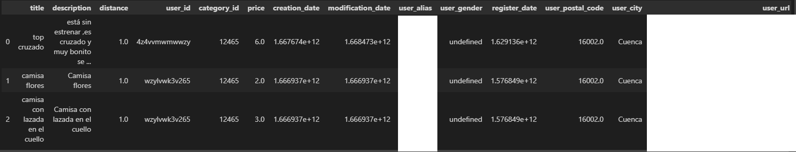

![Made-love][made-love-shield]
[![LinkedIn][linkedin-shield]](https://linkedin.com/daniel-verdu-torres)


# Wallapop scraper

Design of a library for scrapping data from Wallapop. It sends a request to the API and returns the results in JSON format. Then the information is stored in a csv file.



## Structure

```text
│
├───.git
│   .gitignore
│   README.md
│   requirements.txt
│   setup-instructions.sh
│   setup.py
│
├───notebooks
│       scrape_users.ipynb
│
└───wallapop_scraper
        scraper.py
        __init__.py

```

## Usage

You can retrieve the items being sold in a particular city by using the following code:

```python
from wallapop_scraper import scraper

# Returns a pandas DataFrame with all the items which are being sold in a particular city
df = scraper.get_items_per_region(user_city, user_province, user_region, user_postal_code,
                        lat, long, country_code='ES', dist=10000, sleep=None,
                        max_items=None)
```

Besides, you can retrieve information from a particular user_id by using the following code:

```python
from wallapop_scraper import scraper

# Returns a dict with information about the user_id
user_info_dict = scraper.get_user_info(user_id)
```

Furthermore, you can retrieve the items that has been sold by a particular user_id, which have a review in the webpage by using the following code:

```python
from wallapop_scraper import scraper

# Returns a list in which each element is a dict of an item with its available information
sold_items = scraper.get_sold_items(user_id)
```

## Installation

First, you need to install the requirements and then install the library with the following commands:

```bash
pip install -r requirements.txt
python setup.py install
```

## Contributors
This project was developed by:
* [Daniel Verdú](https://github.com/davertor) - https://github.com/davertor
* [Raúl Sanz](https://github.com/rsanzd) - https://github.com/rsanzd

<!--  MARKDOWN LINKS & IMAGES -->
[linkedin-url]: https://linkedin.com/daniel-verdu-torres
[github-url]: https://github.com/davertor

[made-love-shield]: https://img.shields.io/badge/-Made%20with%20love%20❤️-orange.svg?style=for-the-badge
[license-shield]: https://img.shields.io/badge/License-GNU-brightgreen.svg?style=for-the-badge
[linkedin-shield]: https://img.shields.io/badge/-LinkedIn-darkblue.svg?style=for-the-badge&logo=linkedin
[github-shield]: https://img.shields.io/badge/-Github-black.svg?style=for-the-badge&logo=github
[twitter-shield]: https://img.shields.io/badge/-Twitter-blue.svg?style=for-the-badge&logo=twitter